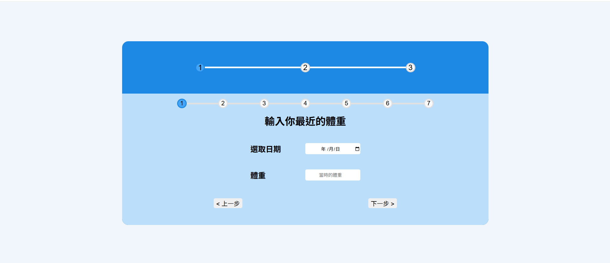
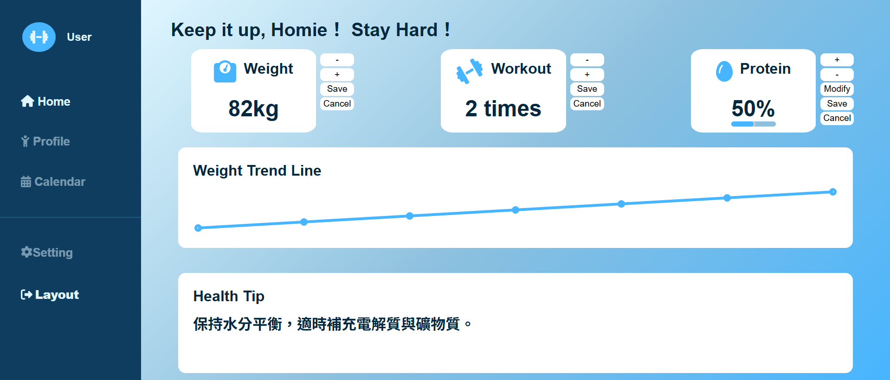

# Fitness Dashboard - 健身紀錄管理平台

## 📌 專案簡介

本專案為一個專屬於健身愛好者的個人化健身數據管理平台，提供使用者每日健身與飲食記錄功能，結合視覺化圖表呈現訓練與飲食趨勢，幫助使用者有效追蹤自身健身進度。

✅ 使用者可以：

- 登入、登出帳號
- 新增、編輯、儲存紀錄
- 視覺化圖表（體重趨勢）

---

## 🚀 Demo 網址

目前專案進設定「固定帳號」登入，尚未開放註冊功能。

- Email: user1@gmail.com / user1@test.com
- Password: 123456

👉 開發中...... <!--[Fitness Dashboard Demo]() 這裡之後補上網址 -->

---

## 🛠️ 技術使用

| 技術         | 說明                               |
| ------------ | ---------------------------------- |
| React        | 前端框架，建構元件化 SPA 架構      |
| Firebase     | Auth 驗證 / Firestore 雲端資料儲存 |
| React Router | 路由管理（登入 / 首頁 / 儀錶板）   |
| Chart.js     | 視覺化圖表（體重、、訓練次數）     |
| SCSS         | RWD 響應式樣式與動畫效果           |
| Git / GitHub | 版本管理與部署                     |

---

## 📂 專案架構

```
src
├── components
│   ├── Card.jsx
│   ├── Chart.jsx
│   └── Sidebar.jsx
├── pages
│   ├── Dashboard.jsx
│   └── Login.jsx
│   └── Setup.jsx
├── Routes
│   └── Router.jsx
├── services
│   └── firebase.jss
├── styles
│   ├── index.scss
│   └── login.scss
│   └── card.scss
│   └── setup.scss
│   └── sidebar.scss
├── App.jsx
└── main.jsx
```

---

## 📸 預覽畫面

### 🔐 登入 / 設定 / 儀錶板

進入時導向 Login Page


登入後進入 Setup Page



輸入完成後進入 Dashboard Page



---

## 🔑 功能說明（🧑🏻‍💻 RWD 開發中....）

| 功能                             | 狀態      |
| -------------------------------- | --------- |
| 登入 / 設定 / 登出               | ✅ 已完成 |
| 健身次數（新增 / 編輯 / 刪除）   | ✅ 已完成 |
| 蛋白質攝取（新增 / 編輯 / 刪除） | ✅ 已完成 |
| 體重圖表                         | ✅ 已完成 |
| 平板 / 手機 RWD 支援             | ⏳ 製作中 |

---

## 🧑‍💻 使用方式

```bash
# clone
git clone https://github.com/freddy990117/Fitness-Dashboard.git

# install
npm install

# run
npm run dev
```

---

## 🛠 開發者筆記

- 強化對 Firebase Auth / Firestore 實戰應用能力
- 元件化思維、狀態管理、路由管理
- 從 UI / UX 出發，設計貼近健身族群的圖表呈現
- 使用 Git Flow 流程規劃，確保開發穩定性與維護性

- commit 前使用 npm run lint，確保無語法與格式錯誤

---

## 📃 License

此專案僅用於個人學習與展示，無商業用途。

---

## 🙌 作者

Created by **Lee Jay 張立杰**  
轉職中前端工程師 🧑🏻‍💻
